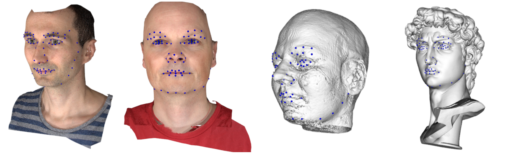
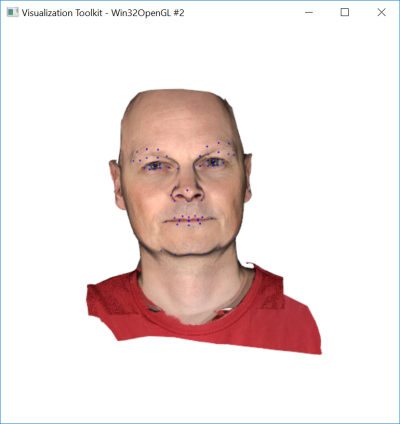
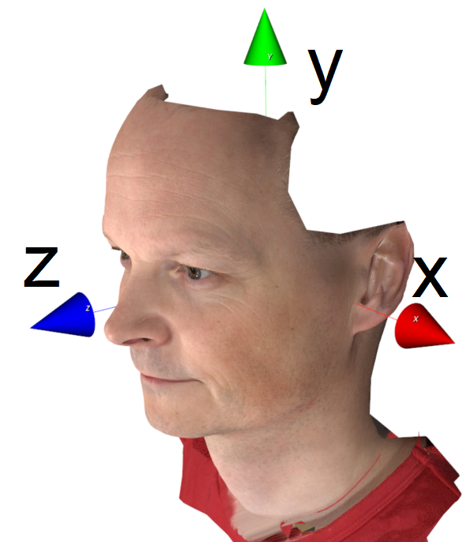
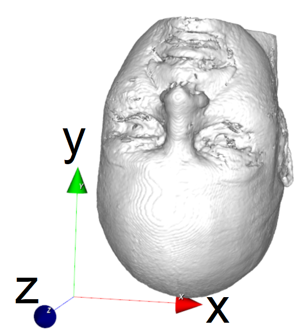
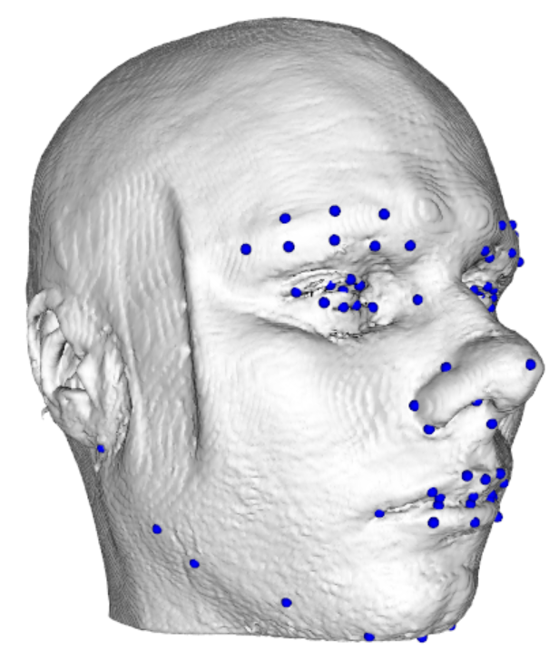
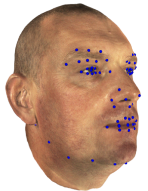
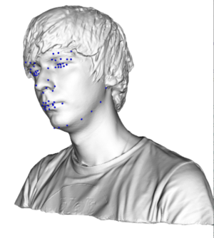
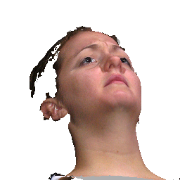
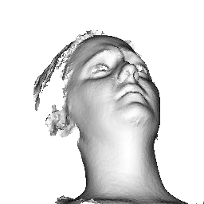
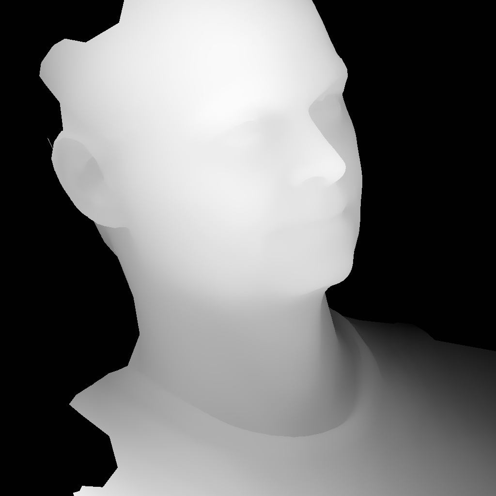

# Deep learning based 3D landmark placement
A tool for accurately placing 3D landmarks on 3D facial scans based on the paper [Multi-view Consensus CNN for 3D Facial Landmark Placement](https://arxiv.org/abs/1910.06007).



## Citing Deep-MVLM

If you use Deep-MVLM in your research, please cite the
[paper](https://arxiv.org/abs/1910.06007):
```
@inproceedings{paulsen2018multi,
  title={Multi-view Consensus CNN for 3D Facial Landmark Placement},
  author={Paulsen, Rasmus R and Juhl, Kristine Aavild and Haspang, Thilde Marie and Hansen, Thomas and Ganz, Melanie and Einarsson, Gudmundur},
  booktitle={Asian Conference on Computer Vision},
  pages={706--719},
  year={2018},
  organization={Springer}
}
```

## Updates
- 24-03-2021 : Hopefully the "cannot instantiate 'WindowsPath'" issue should now be solved. Pre-trained models no longer contain path variables. 

## Getting Deep-MVLM

Download or clone from github

### Requriements

The code has been tested under Windows 10 both with a GPU enabled (Titan X) computer and without a GPU (works but slow). It has been tested with the following dependencies

- Python 3.7
- Pytorch 1.2
- vtk 8.2
- libnetcdf 4.7.1 (needed by vtk)
- imageio 2.6
- matplotlib 3.1.1
- scipy 1.3.1
- scikit-image 0.15
- tensorboard 1.14
- absl-py 0.8


## Getting started
The easiset way to use Deep-MVLM is to use the pre-trained models to place landmarks on your meshes. To place the [DTU-3D](https://bmcmedimaging.biomedcentral.com/articles/10.1186/1471-2342-14-35) landmarks on a mesh try:

```
python predict.py --c configs/DTU3D-RGB.json --n assets/testmeshA.obj
```
This should create two landmarks files (a .vtk file and a .txt) file in the assets directory and also show a window with a face mesh with landmarks as (its a 3D rendering that can be manipulated with the mouse):



## Supported formats and types

The framework can place landmarks on surface without textures, with textures and with vertex coloring. The supported formats are:

- **OBJ** textured surfaces (including multi textures), non-textured surfaces
- **WRL** textured surfaces (only single texture), non-textured surfaces
- **VTK** textured surfaces (only single texture), vertex colored surfaces, non-textured surfaces
- **STL** non-textured surfaces
- **PLY** non-textured surfaces


### Rendering types
The type of 3D rendering used is specified in the **image_channels** setting in the JSON configuration file. The options are:
- **geometry** pure geometry rendering without texture (1 image channel)
- **depth** depth rendering (the z-buffer) similar to range scanners like the Kinect (1 image channel)
- **RGB** texture rendering (3 image channels)
- **RGB+depth** texture plus depth rendering (3+1=4 image channels)
- **geometry+depth** geometry plus depth rendering (1+1=2 image channels)

### Pre-trained networks

The algorithm comes with pre-trained networks for the landmark sets **DTU3D** consisting of 73 landmarks that are described in this [paper](https://bmcmedimaging.biomedcentral.com/articles/10.1186/1471-2342-14-35) and [here](docs/DTU-3D_landmark_info.txt) and the landmark set from **BU-3DFE** described further down.

## Predict landmarks on a single scan

First determine what landmark set you want to place. Either **DTU3D** or **BU-3DFE**. Secondly, choose the rendering type suitable for your scan. Here are some recommendations:

- **surface with RGB texture** use **RGB+depth** or **RGB**
- **surface with vertex colors** use **RGB+depth** or **RGB**
- **surface with no texture** use **geometry+depth**, **geometry** or **depth**

Now you can choose the JSON config file that fits your need. For example **configs/DTU3D-RGB+depth.json**. Finally, do the prediction:

```
python predict.py --c configs/DTU3D-RGB+depth.json --n yourscan
```

## Predict landmarks on a directory with scans

Select a configuration file following the approach above and do the prediction:

```
python predict.py --c configs/DTU3D-RGB+depth.json --n yourdirectory
```

where **yourdirectory** is a directory (or directory tree) containing scans. It will process all **obj, wrl, vtk, stl** and **ply** files.

## Predict landmarks on a file with scan names

Select a configuration file following the approach above and do the prediction:

```
python predict.py --c configs/DTU3D-RGB+depth.json --n yourfile.txt
```

where **yourfile.txt** is a text file containing names of scans to be processed.

## Specifying a pre-transformation

The algorithm expects that the face has a general placement and orientation. Specifically, that the scan is centered around the origin and that the nose is pointing in the z-direction and the up of the head is aligned with the y-axis as seen here:



In order to re-align a scan to this system, a section of the JSON configuration file can be modified:
```
"pre-align": {
	"align_center_of_mass" : true,
	"rot_x": 0,
	"rot_y": 0,
	"rot_z": 180,
	"scale": 1,
	"write_pre_aligned": true
}
```
Here the scan is first aligned so the center-of-mass of the scan is aligned to the origo. Secondly, it is rotated 180 degrees around the z-axis. The rotation order is z-x-y. This will align this scan:



so it is aligned for processing and the result is:



this configuration file can be found as [configs/DTU3D-depth-MRI.json](configs/DTU3D-depth-MRI.json)

## How to use the framework in your own code

Detect 3D landmarks in a 3D facial scan

```Python
import argparse
from parse_config import ConfigParser
import deepmvlm
from utils3d import Utils3D

dm = deepmvlm.DeepMVLM(config)
landmarks = dm.predict_one_file(file_name)
dm.write_landmarks_as_vtk_points(landmarks, name_lm_vtk)
dm.write_landmarks_as_text(landmarks, name_lm_txt)
dm.visualise_mesh_and_landmarks(file_name, landmarks)
```

The full source (including how to read the JSON config files) is [predict.py](predict.py)


## Examples

The following examples use data from external sources.

### Artec3D Eva example

Placing landmarks on an a scan produced using an [Artec3D Eva 3D scanner](https://www.artec3d.com/portable-3d-scanners/artec-eva) can be done like this:

- download the example [head scan](https://www.artec3d.com/3d-models/face) in obj format
- then:
```
python predict.py --c configs\DTU3D-RGB_Artec3D.json --n Pasha_guard_head.obj
```


- download the example [man bust](https://www.artec3d.com/3d-models/head) in obj format
- then:
```
python predict.py --c configs\DTU3D-depth.json --n man_bust.obj
```



### Using Multiple GPUs

Multi-GPU training and evaluation can be used by setting `n_gpu` argument of the config file to a number greater than one. If configured to use a smaller number of GPUs than available, n devices will be used by default. To use a specific set of GPUs the command line option **--device** can be used:
```
python train.py --device 2,3 --c config.json
```
The program check if a GPU is present and if it has the required CUDA capabilities (3.5 and up). If not, the CPU is used - will be slow but still works.


## How to train and use Deep-MVLM with the BU-3DFE dataset

The Binghamton University 3D Facial Expression Database (BU-3DFE) is a standard database for testing the performance of 3D facial analysis software tools. Here it is described how this database can be used to train and evaluate the performance of Deep-MVLM. The following approach can be adapted to your own dataset.

Start by requesting and downloading the database from [the official BU-3DFE site](http://www.cs.binghamton.edu/~lijun/Research/3DFE/3DFE_Analysis.html)

Secondly, download the 3D landmarks for the raw data from [Rasmus R. Paulsens homepage](http://people.compute.dtu.dk/rapa/BU-3DFE/BU_3DFE_84_landmarks_rapa.zip). The landmarks from the original BU-3DFE distribution is fitted to the cropped face data. Unfortunately, the raw and cropped face data are not in alignment. The data fra Rasmus' site has been aligned to the raw data, thus making it possible to train and evaluate on the raw face data. There are 84 landmarks in this set end they are defined [here](docs/BU-3DFE_landmark_info.txt).

A set of example JSON configuration files are provided. Use for example **configs/BU_3DFE-RGB_train_test.json** and modify it to your needs. Change **raw_data_dir**, **processed_data_dir**, **data_dir** (should be equal to processed_data_dir) to your setup.

### Preparing the BU-3DFE data
In order to train the network the data should be prepared. This means that we pre-render a set of views for each input model. On the fly rendering during training is too slow due to the loading of the 3D models. Preparing the data is done by issuing the command:

```
python preparedata --c configs/BU_3DFE-RGB_train_test.json
```

This will pre-render the image channels **rgb**, **geometry**, **depth**. If the **processed_data_dir** is set to for example **D:\\data\\BU-3DFE_processed\\**, the rendered images will be placed in a folder **D:\\data\\BU-3DFE_processed\\images\\** and the corresponding 2D landmarks in a folder **D:\\data\\BU-3DFE_processed\\2D LM\\**. The renderings should look like this:



The corresponding landmark file is a standard text file with landmark positions corresponding to their placement in the rendered images. This means that this dataset can now be used to train a standard 2D face landmark detector.

The dataset will also be split into a **training** and a **test** set. The ids of the scans used for training can be found in the **dataset_train.txt** file and the test set in the **dataset_test.txt** file. Both files are found in the **processed_data_dir**.

### Training on the BU-3DFE pre-rendered data
To do the training on the pre-rendered images and landmarks the command
```
python train --c configs/BU_3DFE-RGB_train_test.json
```
is used. The result of the training (the model) will be placed in a folder **saved\\models\\MVLMModel_BU_3DFE\\DDMMYY_HHMMSS\\**, where the **saved** folder can be specified in the JSON configuration file. **DDMMYY_HHMMSS** is the current date and time. A simple training log can be found in **saved\\log\\MVLMModel_BU_3DFE\\DDMMYY_HHMMSS\\**.
After training, it is recommended to rename and copy the best trained model **best-model.pth** to a suitable location. For example **saved\\trained\\*.

### Tensorboard visualisation
[Tensorboard](https://www.tensorflow.org/tensorboard) visualisation of the training and validation losses can be enabled in the JSON configuration file. The tensorboard data will be placed in the **saved\\log\\MVLMModel_BU_3DFE\\DDMMYY_HHMMSS\\** directory. 

#### Resuming training
If training is stopped for some reason, it is possible to resume training by using
```
python train --c configs/BU_3DFE-RGB_train_test.json --r path-to-model\best-model.pth
```
where **path-to-model** is the path to the current best model (for example **saved\\models\\MVLMModel_BU_3DFE\\DDMMYY_HHMMSS\\**).


### Evaluating the model trained on the BU-3DFE data
In order to evaluate the performance of the trained model, the following command is used:
```
python test --c configs/BU_3DFE-RGB_train_test.json --r path-and-file-name-of-model.pth
```
where **path-and-file-name-of-model.pth** is the path and filename of the model that should be tested. It should match the configuration in the supplied JSON file. Test results will be placed in a folder named **saved\\temp\\MVLMModel_BU_3DFE\\DDMMYY_HHMMSS\\**. Most interesting is the **results.csv** that lists the distance error for each landmark for each test mesh.


## Team
[Rasmus R. Paulsen](http://people.compute.dtu.dk/rapa) and [Kristine Aavild Juhl](https://www.dtu.dk/english/service/phonebook/person?id=88961&tab=2&qt=dtupublicationquery)

## License
Deep-MVLM is released under the MIT license. See the [LICENSE file](LICENSE) for more details.

## Credits
This project is based on the PyTorch template  [pytorch-template](https://github.com/victoresque/pytorch-template) by [Victor Huang](https://github.com/victoresque)

We gratefully acknowledge the support of NVIDIA Corporation with the donation of the Titan Xp GPU used for this research.
